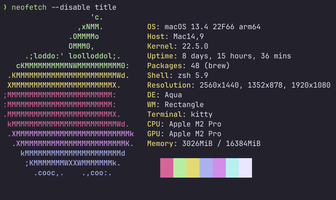

  

<h1 align="center">
  HardHacker Theme for Kitty 
</h1>

## Install

- Until the theme is merged into the [kitty-themes](https://github.com/kovidgoyal/kitty-themes):
  1. Clone this repository, or copy the contents of the .conf file into your configuration path (typically ~/.config/kitty)
  2. Name your .conf file as you please
  3. In your kitty.conf file add the following `include <conf_filename>.conf`
  4. Save the configuration file and reload preferences
- When the theme is admitted into the kitty-themes repo, you can simply install the theme by running `kitty +kitten themes` and searching for HardHacker
